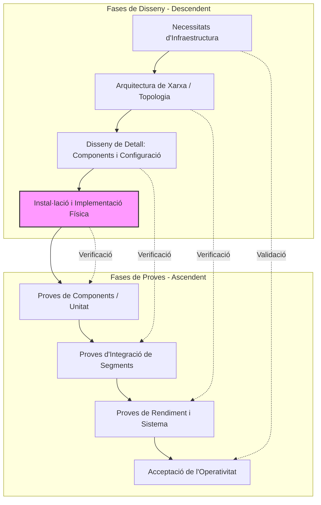

# EL PROJECTE (capítol)
(Albert) El que us explicarem aquí no està relacionat amb la part tècnica dels projectes. Cada projecte és un món diferent de tecnologies i de funcionalitats i documentació. Hi ha moltes coses comunes a tots els projectes, que tenen més a veure amb la part de la gestió del mateix i que són molt diferents respecte del que coneixeu del cicle.

```alert-info
Fer un projecte no és una cursa de velocitat. No donen premi al que acaba primer. Tot es tracta de fer funcionar el que se li ha demanat que faci, i ho faci bé.
```

Aquí teniu un parell de vídeos resum. Un sobre el cicle en V baixa i un altre sobre com es fan els protocols de proves.

## EL CICLE EN V BAIXA
Els projectes d'enginyeria i els informàtics no són una excepció, segueixen una metodologia que evita moltes de les errades i evitar problemes de gestió. Resoldre malament un problema de disseny de xarxes o un component informàtic mal seleccionat té un impacte molt negatiu en el resultat final del projecte, i el pot fer fracassar.

No cal que sapigueu totes les passes en detall. Us fem un esquema resum amb una descripció bàsica que us doni la pista que necessiteu per entendre'l i veure què soluciona. Se li diu cicle en V baixa perquè té una part de disseny (descendent) i una part de verificació (ascendent). Hi ha una fase de verificació per a cada fase de disseny i implementació.


|Fase de Disseny	|Fase de Proves Corresponent	|Objectiu en Xarxes/Maquinari|
|---|---|---|
|Necessitats	|Acceptació	|¿L'infraestructura suporta el volum de trànsit pactat?|
|Arquitectura	|Sistema	|¿La topologia resol la segregació i redundància exigida?|
|Disseny de Detall	|Integració	|¿Els protocols i subxarxes es comuniquen com s'havia dissenyat?|
|Instal·lació	|Components	|¿Cada cable, port i dispositiu funciona físicament?|




### EL CICLE DESCENDENT (DISSENY I IMPLEMENTACIÓ)
1. **Requisits de l'usuari**. Comença a l'oferta. Si l'heu feta bé, serà molt fàcil completar el primer pas. Què necessita l'usuari i què vol obtenir al final.
   - Sabeu fer tot el que us demana el client? Si no és així, què necessito per aprendre / saber més sobre el que ens demana? Què és el que no sé? Com ho puc aprendre?
   - Recollir documentació, buscar casos similars, resoldre els dubtes que teniu abans de començar.
   - Reviseu els temps que heu marcat al calendari de l'oferta.
   - Sigueu honestos. Si hi ha res que no sabeu fer o que no trobeu, o teniu dubtes sobre com implementar, s'han d'informar i resoldre en aquesta fase.
2. **Definim l'arquitectura del sistema**. Com hem de fer les coses per a aconseguir els requisits. 
   - Preparar el disseny. Dibuixar i pensar. Què és el que volem en acabar el projecte? Com ho farem? De nou, la metodologia que heu descrit a l'oferta us ajudarà.
     - Quin disseny de xarxa farem? Disseny físic i lògic?
     - Quins components necesitarem? Tenim disponibilitat? Compleixen amb les especificacions?
   - Fer prototipus. Models de treball més petits, que treballen aïllats. Tenir clar que els elements que necessiteu funcionen per separat, i fer proves de connexió parcials que assegurin que sabeu fer totes les fases del projecte abans d'abordar el global.
   - Documenteu tot el que feu. Ho podeu necessitar més endavant. No feu les coses de memòria. Manteniu una webgrafia, un devlog, una llista de referències, documents, el que millor us funcioni. I que estiguin a l'abast (en local) sempre que sigui possible.
   - No correu. Resoldre els problemes aquí implica que anireu més de pressa a les fases següents.
 3. **Fem el disseny de detall**. Amb tot el que sabem i hem après, fem "els plànols" definitius del projecte, concretem tot el material, tota la documentació i tanquem la part de preparació.
   - No passeu de fase fins que esteu completament segurs que ho heu mirat tot.
   - Aquí heu de resoldre ja tots els problemes i que no tingueu cap indefinició. No pot haver "això segur que no dona problemes, no cal que ho mirem"
     - Si esteu fent una xarxa, aquí fareu el detall dels equips que muntareu, la xarxa física i lògica definitives i tots els diagrames de connexionat.
     - Si esteu dissenyant una pàgina web, aquí tindreu tots els wireframes, esquemes de colors, estils, etc.
 4. **Instal·lació i implementació**. Aquesta fase es el cor del projecte. Aquí fem la construcció real del sistema, ensamblem els components, etc. Fem que el sistema funcioni tal i com el tenim dissenyat.
    - Amb tot el que sabeu ja del sistema i si ho heu preparat bé, aquesta fase és molt senzilla. Només heu de seguir la documentació que heu fet.
    - Malgrat tota la preparació, SEMPRE passen imprevistos, i potser les coses no funcionen com ho havíeu previst. Documenteu els canvis i si afecten a res que el client ha demanat, informeu-lo.

### EL CICLE ASCENDENT (VERIFICACIÓ)
5. **Proves de components**. Tots els elements físics i lògics funcionen correctament. Evita que el sistema no funcioni per causes alienes al vostre disseny.
   - Un element que heu muntat té una avaria o un defecte de fabricació.
     - Teniu totes les garanties dels elements físics classificades i guardades per entregar al client.
     - Tots els cables tenen un certificat o si els heu fet vosaltres han passat una prova de validació.
     - Tots els perfils d'usuari tenen els permisos que els correspon.
   - Documenteu totes les proves unitàries i dates d'inici i final de garantia.
   - Si un component s'ha de substituir i compromet el calendari, aviseu el client. 
6. **Proves d'integració**. Les diferents parts del sistema es parlen correctament entre elles. Per cada parell de parts, feu un protocol de proves que us asseguri que les diferents parts del projecte funcionen com es demanava. Això aïlla els possibles problemes i no us passeu hores pensant què pot passar i perquè no funciona.
   - La configuració de cada element que heu fet funciona com estava prevista.
   - Les comunicacions entre els diferents components fan el que han de fer.
7. **Proves del sistema**. Aquí proveu que heu fet bé la feina. Tot el projecte funciona i resol el problema que us ha demanat el client. Heu de posar el sistema al límit, i veure que funciona correctament en totes les circumstàncies, de manera que el client no pugui trobar errades.
   - Entreu dades errònies i veieu com el sistema gestiona els errors.
   - Proveu de fer coses que el sistema no hauria de permetre, i que efectivament no les deixa fer. Per exemple, comunicar equips en una xarxa que us han dit que no es poden comunicar.
   - Un cop les proves de sistema es passen correctament, li podeu posar el llacet al projecte. Feu els manuals, prepareu l'entrega.
8. **Acceptació del client**. Davant del client, el protocol de proves d'acceptació ha de demostrar que totes les necessitats del client es poden resoldre amb el sistema que heu creat.
   - Cada petició del client (que hi ha a l'oferta) ha de tenir una prova que mostri que dona de resultat el que demanava.
   - Mostreu en detall totes les proves que heu fet abans. No cal que les torneu a passar, però sí que les porteu perquè el client les vegi, si les demana.
   - Un cop heu mostrat que totes les proves funcionen, podeu procedir a parlar amb el client del tancament del projecte.


## PROTOCOLS DE PROVES.
Un protocol de proves és un document que defineix, pas a pas, les instruccions i les dades per verificar que un sistema compleix els seus requisits.

Ha de garantir la repetibilitat i l'objectivitat:
   - Permet que qualsevol persona seguint el protocol, repeteixi la mateixa prova de la mateixa manera i obtenir el mateix resultat
   - Serveix per crear un registre d'errades o incidents.
     - Si un component falla, el protocol permet saber exactament sota quins condicions ha passat. Permet identificar errors
     - la certificació de qualitat davant el client.

### COM FER UN PROTOCOL DE PROVES
Per fer un protocol, primer has de definir:
   - Què es vol provar.
   - Que necessites per mesurar el resultat.
   - Com faràs la prova. 
   - Quin resultat és el que vols trobar.
   - Quin resultat has trobat.

El protocol es converteix en un document que ha de poder lliurar-se al client si el demana, i ha de poder reproduir.

L'objectiu final és obtenir un Informe de Proves (Test Report) que recull tots els protocols passats i el seu resultat.

Amb això es pot demostrar de forma inequívoca que el projecte ha superat la fase del Cicle en V. 


